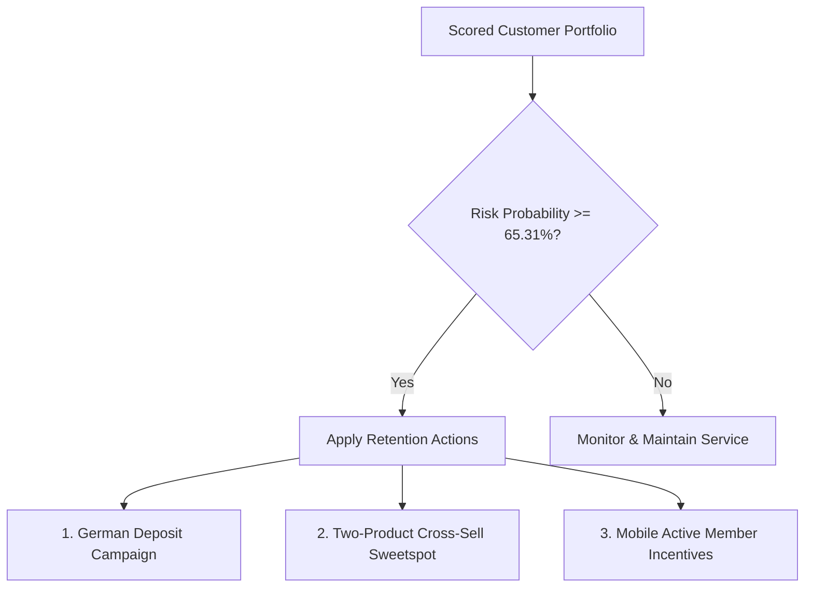

# Executive Summary: Bank Customer Churn Predictive Scoring

**Target Audience**: Executive Stakeholders  
**Focus**: Business KPIs, Predictive Insights, and Strategic Retention Actions  

---

## 🏦 Business Context & Objective
Retail bank customer churn represents a significant drain on profitability, with customer acquisition costs (CAC) typically 5–7x higher than retention costs. Using a portfolio of 10,000 European retail banking customers, we built a machine learning risk-scoring engine to proactively flag customers likely to exit. By identifying these customers *before* they leave, we can target them with retention incentives, protecting fee revenue and core deposit balances.

---

## 📊 Core Portfolio KPIs

* **Portfolio Size**: 10,000 Active Accounts  
* **Annual Churn Rate**: **20.37%** (2,037 customers exited historically)  
* **Retention Champion Model**: Gradient Boosting (Test ROC-AUC: **0.8677**)  
* **Optimized Churn Threshold**: **65.31%** (Tuned to maximize ROI / F1-score)  
* **Flagged Portfolio**: **12.45%** of base (1,245 active customers flagged for immediate retention action)  
* **Predictive Capture (Recall)**: **63.14%** of actual churners will be captured by the system  
* **Marketing Budget Precision**: **64.41%** (For every 100 customers targeted, 64 are true churn risks, minimizing budget waste)

---

## 🔑 Key Strategic Findings

### 1. The "Product Complexity" Friction
* **Insight**: Product holding is the most critical actionable driver. Customers with exactly **2 products** show a very low churn rate of **7.6%**. However, adding a 3rd or 4th product triggers an exponential spike in churn to **82.7%** and **93.3%** respectively.
* **Impact**: Shifting a high-risk multi-product customer back to the 2-product state reduces risk by up to **80%**.

### 2. The German Region Risk Profile
* **Insight**: Geography is a strong churn predictor. German accounts exit at a rate of **32.4%**, double that of France (16.1%) and Spain (16.7%).
* **Impact**: A German customer with similar financial holdings carries twice the baseline risk of a French or Spanish counterpart.

### 3. Demographic & Activity Sensitivity
* **Insight**: Age has a linear positive relationship with churn. Customers aged 45–60 churn at three times the rate of younger segments (18–35). Inactive members churn at a rate of **26.9%** vs active members at **14.2%**.

---

## 🛠️ Recommended Action Plan

### 1. German Loyalty Initiative
* **Action**: Launch localized deposit promotions matching competitor rates in Germany and assign dedicated relationship managers for accounts with balances > €100k.

### 2. Product Consolidation Campaign
* **Action**: Train customer service teams to audit accounts with 3+ products. Offer a streamlined "loyalty bundle" to reduce service friction and move them closer to the 2-product sweet spot.

### 3. Digital Active-Member Push
* **Action**: Run target email campaigns and in-app notifications offering fee waivers or cashback if inactive accounts log in to the mobile banking app and execute 5 debit transactions monthly.
